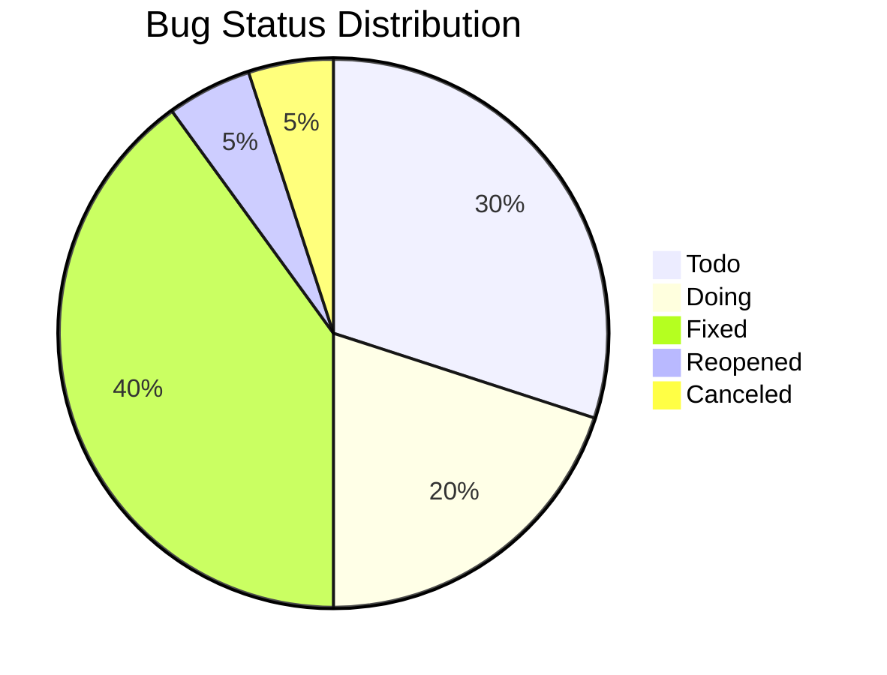

# Bug Test Report - [Ngày tháng]

## 1. Overview

### Thống kê tổng quan
| Metric | Số lượng |
|--------|----------|
| Tổng số bugs | 0 |
| Bugs mới (3 ngày gần nhất) | 0 |
| Bugs đã fix | 0 |
| Bugs đang xử lý | 0 |
| Bugs chưa xử lý | 0 |

### Phân bố theo trạng thái

## 2. Danh sách Bugs

| Bug ID | Mô tả | Tính năng | Trạng thái | Assignee | Ngày phát hiện | Môi trường |
|--------|-------|-----------|------------|----------|----------------|------------|
| BUG-001 | Layout lệch trong tính năng search | FR-009 | Fixed | Mai | 2025-06-10 | Dev |
| BUG-002 | [Mô tả] | [Feature] | [Status] | [Name] | [Date] | [Env] |

## 3. Bugs đã xử lý (3 ngày gần nhất)

### [Ngày hiện tại]
- BUG-001: Layout lệch trong tính năng search
  - Assignee: Mai
  - Feature: FR-009
  - Status: Fixed
  - Evidence: [Link to evidence]

### [Ngày hiện tại - 1]
- [Danh sách bugs]

### [Ngày hiện tại - 2]
- [Danh sách bugs]

## 4. Phân tích xu hướng
