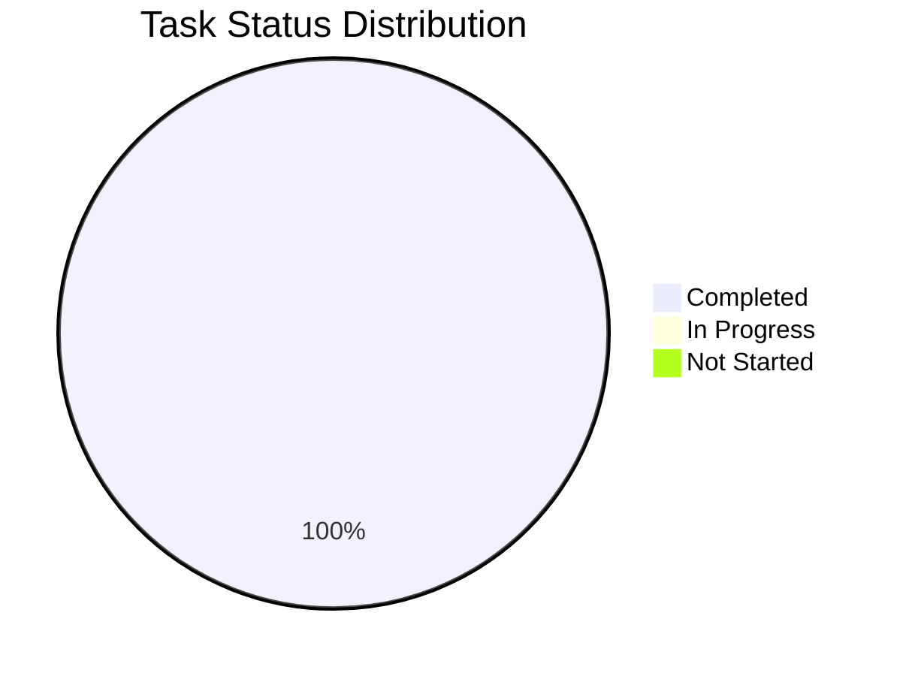

# Báo Cáo Phát Triển Cá Nhân - Đức (v2)

## 1. Tổng Quan Tiến Độ

Tổng tiến độ dự án: 100%

## 2. Báo Cáo Hoạt Động Gần Nhất

### ✨ Thành tựu
- Sửa giao diện đăng nhập X, hiển thị ảnh đại diện từ X nếu có
- Check các bug aiptos#39, aiptos#171, aiptos#35, aiptos#145, aiptos#113
- Setup môi trường production

### 🚧 Đang thực hiện
- Tiếp tục setup môi trường production (12/06/2025 hoàn thành)

### ⚠️ Vấn đề và Giải pháp
- Không có

## 3. Tasks

| Feature | Todo | Committed | Merged | Tested | Demo | Delivered | Mainnet | Dự kiến hoàn thành |
|---------|:----:|:---------:|:------:|:------:|:----:|:---------:|:-------:|-------------------|
| **FR-001 - Kết nối ví Aptos** |  |  |  |  | ✓ | ✓ | ✓ | 11/06/2025 |
| - UI Components |  |  |  | ✓ | ✓ | ✓ | ✓ | 11/06/2025 |
| - Wallet Integration |  |  |  | ✓ | ✓ | ✓ | ✓ | 11/06/2025 |
| - Error Handling |  |  |  | ✓ | ✓ | ✓ | ✓ | 11/06/2025 |
| **FR-004 - Đăng nhập X** |  |  |  |  | ✓ | ✓ | ✓ | 11/06/2025 |
| - Authentication Flow |  |  |  | ✓ | ✓ | ✓ | ✓ | 11/06/2025 |
| - User Session Management |  |  |  | ✓ | ✓ | ✓ | ✓ | 11/06/2025 |
| - Profile Integration |  |  |  | ✓ | ✓ | ✓ | ✓ | 11/06/2025 |

Chú thích:
- ✓: Đã hoàn thành
- Các cột trống: Đã vượt qua trạng thái này 