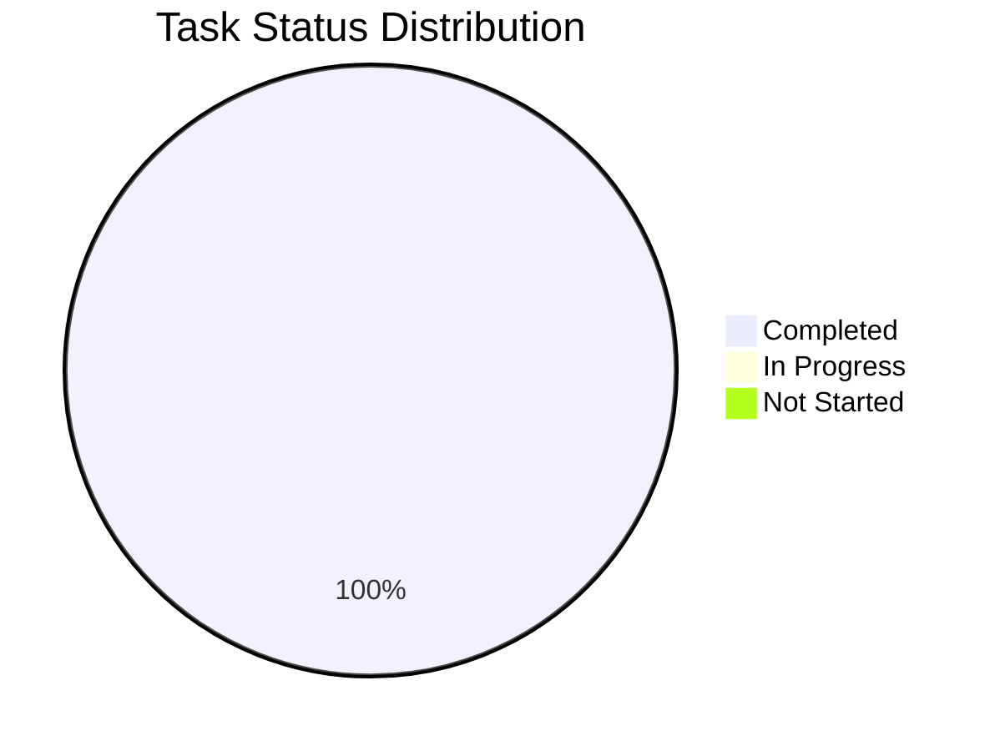

# Báo Cáo Phát Triển Cá Nhân - Đức

## 1. Tổng Quan Tiến Độ

Tổng tiến độ dự án: 100%

## 2. Báo Cáo Hoạt Động Gần Nhất

### ✨ Thành tựu
- Sửa giao diện đăng nhập X, hiển thị ảnh đại diện từ X nếu có
- Check các bug aiptos#39, aiptos#171, aiptos#35, aiptos#145, aiptos#113
- Setup môi trường production

### 🚧 Đang thực hiện
- Tiếp tục setup môi trường production (12/06/2025 hoàn thành)

### ⚠️ Vấn đề và Giải pháp
- Không có

## 3. Danh Sách Nhiệm Vụ đã và đang Thực Hiện

### Bugs
| Bug ID | Mô tả | Trạng thái | Dự kiến hoàn thành | Ghi chú |
|--------|-------|------------|-------------------|----------|

### FR-001 - Kết nối ví Aptos
| Tính năng / Task | Trạng thái | Ngày hoàn thành | Ghi chú |
|------------------|------------|-----------------|----------|
| **UI** | | | |
| Tạo component nút "Connect Wallet" trên Header | Hoàn thành | 11/06/25 | |
| Tạo component Modal/Popup để hiển thị danh sách các ví (Petra, Martian, Pontem) | Hoàn thành | 11/06/25 | |
| Tạo component hiển thị thông tin người dùng sau khi kết nối (địa chỉ ví, nút Disconnect) | Hoàn thành | 11/06/25 | |
| Tạo component thông báo (toast/alert) cho các trạng thái kết nối (thất bại, thành công) | Hoàn thành | 11/06/25 | |
| **Logic** | | | |
| Cài đặt và cấu hình thư viện Aptos Wallet Adapter | Hoàn thành | 11/06/25 | |
| Xây dựng hook/service quản lý trạng thái kết nối ví (wallet state management) | Hoàn thành | 11/06/25 | |
| Triển khai logic xử lý sự kiện click nút "Connect Wallet" để mở modal | Hoàn thành | 11/06/25 | |
| Triển khai logic kết nối và xử lý lỗi cho từng ví trong danh sách | Hoàn thành | 11/06/25 | |
| Triển khai logic ngắt kết nối (disconnect) | Hoàn thành | 11/06/25 | |
| **Kiểm thử (Testing)** | | | |
| Kiểm thử luồng kết nối/ngắt kết nối thành công với ví Petra | Hoàn thành | 11/06/25 | |
| Kiểm thử luồng kết nối/ngắt kết nối thành công với ví Nightly | Hoàn thành | 11/06/25 | |
| Kiểm thử luồng kết nối/ngắt kết nối thành công với ví Pontem | Hoàn thành | 11/06/25 | |
| Kiểm thử luồng người dùng từ chối kết nối từ popup của ví | Hoàn thành | 11/06/25 | |
| Kiểm tra hiển thị responsive của các component trên các kích thước màn hình | Hoàn thành | 11/06/25 | |

### FR-004 - Đăng nhập người dùng X
| Tính năng / Task | Trạng thái | Ngày hoàn thành | Ghi chú |
|------------------|------------|-----------------|----------|
| **UI** | | | |
| Tạo component nút "Đăng nhập bằng X" | Hoàn thành | 11/06/25 | |
| Tạo component hiển thị thông tin người dùng sau khi đăng nhập (avatar, tên X) | Hoàn thành | 11/06/25 | |
| Tạo component hiển thị trạng thái đang tải (loading/spinner) trong quá trình đăng nhập | Hoàn thành | 11/06/25 | |
| **Logic** | | | |
| Cài đặt và cấu hình thư viện xác thực (vd: NextAuth.js) | Hoàn thành | 11/06/25 | |
| Cấu hình X/Twitter OAuth Provider với API keys | Hoàn thành | 11/06/25 | |
| Tạo API endpoint để xử lý callback từ X và tạo phiên đăng nhập | Hoàn thành | 11/06/25 | |
| Triển khai logic lưu thông tin người dùng (tên, avatar) vào session/context | Hoàn thành | 11/06/25 | |
| Triển khai logic đăng xuất, hủy phiên làm việc | Hoàn thành | 11/06/25 | |
| **Kiểm thử (Testing)** | | | |
| Kiểm thử luồng đăng nhập thành công và hiển thị đúng thông tin người dùng | Hoàn thành | 11/06/25 | |
| Kiểm thử luồng đăng xuất thành công | Hoàn thành | 11/06/25 | |
| Kiểm thử trường hợp người dùng hủy bỏ (từ chối) trên trang xác thực của X | Hoàn thành | 11/06/25 | |
| Kiểm thử xử lý lỗi khi API của X không phản hồi hoặc trả về lỗi | Hoàn thành | 11/06/25 | |
