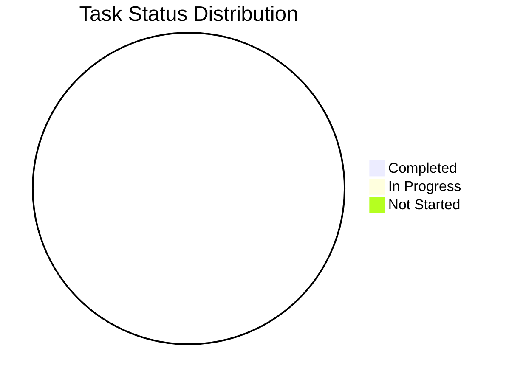

# Báo Cáo Phát Triển Cá Nhân - Đức

## 1. Tổng Quan Tiến Độ

Tổng tiến độ dự án: 100%

## 2. Báo Cáo Hoạt Động Gần Nhất

### ✨ Thành tựu
- Sửa giao diện đăng nhập X, hiển thị ảnh đại diện từ X nếu có
- Check các bug aiptos#39, aiptos#171, aiptos#35, aiptos#145, aiptos#113
- Setup môi trường production

### 🚧 Đang thực hiện
- Tiếp tục setup môi trường production

### ⚠️ Vấn đề và Giải pháp
- Không có

## 3. Danh Sách Nhiệm Vụ đã và đang Thực Hiện

### Bugs
| Bug ID | Mô tả | Trạng thái | Dự kiến hoàn thành | Ghi chú |
|--------|-------|------------|-------------------|----------|

### FR-001 - Kết nối ví Aptos
| Tính năng / Task | Trạng thái | Ngày hoàn thành | Ghi chú |
|------------------|------------|-----------------|----------|

### FR-004 - Đăng nhập người dùng X
| Tính năng / Task | Trạng thái | Ngày hoàn thành | Ghi chú |
|------------------|------------|-----------------|----------|
