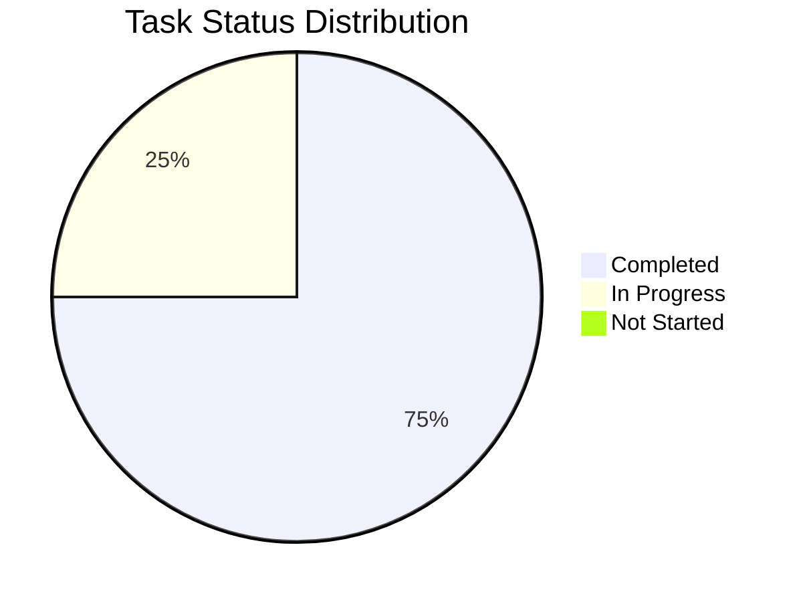

# Báo Cáo Phát Triển Cá Nhân - Mai

## 1. Tổng Quan Tiến Độ

Tổng tiến độ dự án: 75%

## 2. Báo Cáo Hoạt Động Gần Nhất

### ✨ Thành tựu
- Hoàn thành animation transaction list với trải nghiệm người dùng mượt mà
- Triển khai animation chạy chữ cho project graduate
- Hoàn thiện tính năng upload hình ảnh token với hỗ trợ gif và svg

### 🚧 Đang thực hiện
- Tối ưu hiệu năng sort và search cho project list
- Fix BUG-001: Layout lệch trong tính năng search tại màn hình home
- Hoàn thiện FR-010: Hiển thị Dòng Chảy Giao dịch Gần Đây
- Dự kiến hoàn thành: 11/06/2025

### ⚠️ Vấn đề và Giải pháp
- Performance sort và search: Đang implement debounce và thêm cache layer
- API calls tốn thời gian: Tối ưu bằng caching và batch requests
- Thông số trader cần được kiểm tra và cập nhật lại

## 3. Danh Sách Nhiệm Vụ đã và đang Thực Hiện

### Bugs
| Bug ID | Mô tả | Trạng thái | Dự kiến hoàn thành | Ghi chú |
|--------|-------|------------|-------------------|----------|
| BUG-001 | Layout lệch trong tính năng search tại màn hình home | 🔄 Todo | 12/06/2025 | Ảnh hưởng UX của màn hình home |

### FR-002 - Tạo Token Mới
| Tính năng / Task | Trạng thái | Ngày hoàn thành | Ghi chú |
|------------------|------------|-----------------|----------|
| Tạo form upload hình ảnh token | ✅ Hoàn thành | 02/06/2025 | Hỗ trợ gif và svg |
| Validate thông tin creator | ✅ Hoàn thành | 02/06/2025 | Fix lỗi validation |
| Check balance trước khi tạo project | ✅ Hoàn thành | 02/06/2025 | Validation quan trọng |
| Tính toán giá token khi tạo project | ✅ Hoàn thành | 08/06/2025 | Feature update |

### FR-009 - Hiển thị Danh sách Token/Dự án và Tìm kiếm
| Tính năng / Task | Trạng thái | Ngày hoàn thành | Ghi chú |
|------------------|------------|-----------------|----------|
| Sửa scaling ảnh thẻ project ở home | ✅ Hoàn thành | 03/06/2025 | UI improvement |
| Lắp API search input header | ✅ Hoàn thành | 02/06/2025 | Tích hợp chức năng tìm kiếm |
| Ghép dữ liệu API mới cho home | ✅ Hoàn thành | 08/06/2025 | Integration |
| Sort và search cho project list | 🔄 Đang thực hiện | 11/06/2025 | Đang phát triển |

### FR-010 - Hiển thị Dòng Chảy Giao dịch Gần Đây
| Tính năng / Task | Trạng thái | Ngày hoàn thành | Ghi chú |
|------------------|------------|-----------------|----------|
| Làm animation transaction list | Chưa Xong | - | UI enhancement |
| Làm animation chạy chữ cho project graduate | 🔄 Đang thực hiện | - | UI enhancement |
| Sửa thông số trader | ⚠️ Cần kiểm tra lại | - | Validation required |

