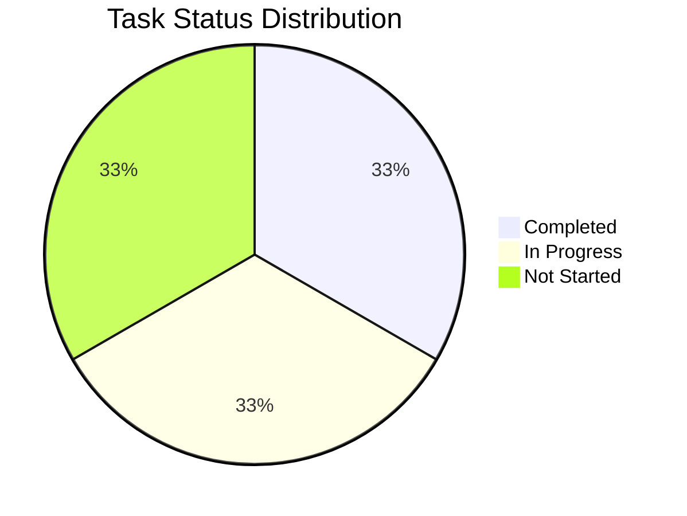

# Báo Cáo Phát Triển Cá Nhân
> Hướng dẫn: Đây là template báo cáo cá nhân. Hãy thay thế các giá trị trong [square brackets] bằng thông tin của bạn.
> Các biểu đồ sẽ tự động được cập nhật khi bạn thay đổi dữ liệu trong các bảng.

## 1. Tổng Quan Tiến Độ
> Hướng dẫn: Cập nhật % tiến độ dựa trên số task đã hoàn thành / tổng số task

Tổng tiến độ dự án: [75]%

> Note: Biểu đồ trên sẽ tự động cập nhật khi bạn thay đổi trạng thái các task trong phần 3

## 2. Báo Cáo Hoạt Động Gần Nhất
> Cập nhật ngắn gọn về tiến độ trong tuần/sprint hiện tại

### ✨ Thành tựu
- [Liệt kê thành tựu chính đã hoàn thành]
- [Các milestone đã đạt được]

### 🚧 Đang thực hiện
- [Công việc đang làm]
- [Dự kiến hoàn thành: DD/MM/YYYY]

### ⚠️ Vấn đề và Giải pháp
- [Vấn đề]: [Giải pháp dự kiến]
- [Khó khăn gặp phải]: [Cách giải quyết]

## 3. Danh Sách Nhiệm Vụ
> Hướng dẫn: 
> - Thêm/sửa các task trong bảng bên dưới
> - Trạng thái: Sử dụng một trong ba emoji: ✅ 🔄 ⏳
> - Ngày: Định dạng DD/MM/YYYY

| Tính năng / Task | Trạng thái | Ngày hoàn thành dự kiến | Ghi chú |
|------------------|------------|------------------------|----------|
| [Đăng ký người dùng] | ✅ Hoàn thành | [10/06/2025] | [Ghi chú nếu có] |
| [Xác thực email] | 🔄 Đang thực hiện | [12/06/2025] | [Ghi chú nếu có] |
| [Tích hợp ví Web3] | ⏳ Chưa bắt đầu | [15/06/2025] | [Ghi chú nếu có] |

> Chú thích trạng thái:
> - ✅ Hoàn thành: Task đã được hoàn thành và kiểm tra
> - 🔄 Đang thực hiện: Task đang được phát triển
> - ⏳ Chưa bắt đầu: Task trong kế hoạch nhưng chưa bắt đầu
> Note: Cập nhật các ngày trong biểu đồ Gantt để phản ánh timeline thực tế của dự án
