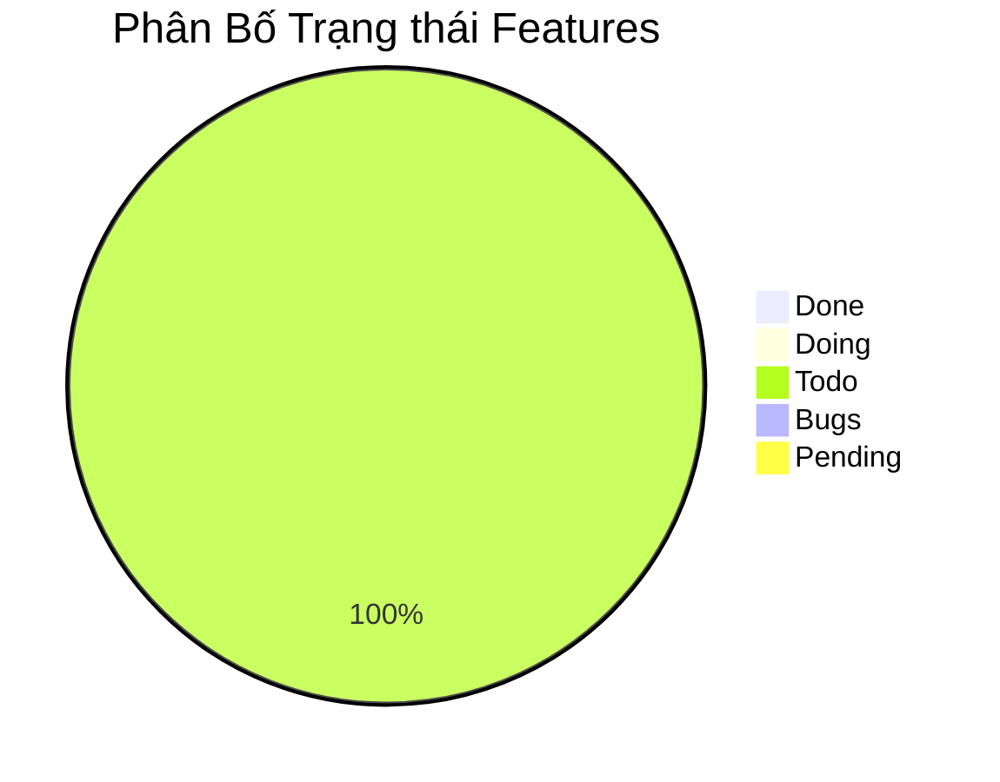

# Báo Cáo Tiến Độ Dự Án

## Tổng Quan
> Biểu đồ thể hiện tổng quan trạng thái của toàn bộ features trong dự án

## Cập Nhật Gần Đây
> Cập nhật về các features đã hoàn thành và vấn đề phát sinh trong tuần/sprint hiện tại

### ✨ Features Hoàn Thành
- [Liệt kê các features vừa hoàn thành]
- [Mô tả ngắn gọn về giá trị mang lại]

### ⚠️ Vấn Đề và Giải Pháp
- [Mô tả vấn đề]: [Giải pháp đang thực hiện]
- [Các rủi ro tiềm ẩn]: [Kế hoạch phòng ngừa]

### Ghi chú

### Hướng dẫn sử_dụng tài_liệu

Tài liệu này nhằm mục đích theo dõi tiến độ và quản lý các Yêu cầu Nghiệp vụ (Business Requirements - BR) cho dự án Clanker. Mỗi mục trong bảng dưới đây mô tả một yêu cầu cụ thể, kèm theo mô tả chi tiết, người chịu trách nhiệm chính, trạng thái thực hiện hiện tại và ngày dự kiến hoàn thành. Việc này giúp đảm bảo tất cả các bên liên quan đều nắm rõ phạm vi công việc và tiến độ chung của dự án.

---

### Progress Reports 

| Tên Features / Task | Mô tả | Trạng thái | Người thực hiện | Ngày hoàn thành dự kiến (EDD) |
|---|---|---|---|---|
| FR-001 - Kết nối Ví Aptos | Hệ thống PHẢI cho phép người dùng kết nối ví Aptos tương thích của họ. | Todo | Chưa gán | YYYY-MM-DD |
| FR-002 - Tạo Token Mới | Hệ thống PHẢI cho phép người dùng (đã đăng nhập và kết nối ví) tạo token mới trên mạng lưới Aptos thông qua một quy trình gồm nhiều bước trên nền tảng Clanker. | Todo | Chưa gán | YYYY-MM-DD |
| FR-003 - Hiển thị Thông tin Chi tiết Token | Hệ thống PHẢI hiển thị thông tin chi tiết và các chức năng tương tác cho mỗi token. | Todo | Chưa gán | YYYY-MM-DD |
| FR-004 - Đăng nhập Người dùng (X/Twitter) | Hệ thống PHẢI cho phép người dùng đăng nhập bằng tài khoản X (Twitter). | Todo | Chưa gán | YYYY-MM-DD |
| FR-005 - Truy cập Trang Quản trị Token (Admin Page) | Hệ thống PHẢI cho phép người tạo token (đã đăng nhập) truy cập một trang quản trị riêng cho token của họ. | Todo | Chưa gán | YYYY-MM-DD |
| FR-006 - Claim Phần thưởng Token từ Trang Admin | Hệ thống PHẢI cho phép người tạo token (trên trang Admin, đã kết nối ví) xem và claim phần thưởng. | Todo | Chưa gán | YYYY-MM-DD |
| FR-007 - Mua Token bằng APT thông qua Tương tác Hợp đồng Hyperion | Hệ thống PHẢI cho phép người dùng mua token bằng APT. | Todo | Chưa gán | YYYY-MM-DD |
| FR-008 - Bán Token để nhận APT thông qua Tương tác Hợp đồng Hyperion | Hệ thống PHẢI cho phép người dùng bán token để đổi lấy APT. | Todo | Chưa gán | YYYY-MM-DD |
| FR-009 - Hiển thị Danh sách Token/Dự án và Tìm kiếm | Hệ thống PHẢI hiển thị danh sách token/dự án và cung cấp chức năng tìm kiếm. | Todo | Chưa gán | YYYY-MM-DD |
| FR-010 - Hiển thị Dòng Chảy Giao dịch Gần Đây trên Nền tảng (Marquee/Ticker) | Hệ thống PHẢI hiển thị dòng chảy các giao dịch mua/bán token vừa thực hiện thành công của các token được tạo trên Clanker đã thực hiện thông qua tương tác với hợp đồng thông minh của Hyperion Aptos (ví dụ: bằng cách lắng nghe các sự kiện (events) phát ra từ contract Hyperion liên quan đến các token này hoặc truy vấn lịch sử giao dịch). | Todo | Chưa gán | YYYY-MM-DD |
| FR-011 - Hiển thị Điều khoản Sử dụng và Chính sách Quyền riêng tư | Hệ thống PHẢI cung cấp quyền truy cập dễ dàng đến các tài liệu này. | Todo | Chưa gán | YYYY-MM-DD |
| FR-012 - Cấu hình Token Vault khi Tạo Token | Hệ thống PHẢI cho phép người tạo token, tùy chọn trong quá trình tạo token (FR-002), cấu hình tham số Vault. | Todo | Chưa gán | YYYY-MM-DD |
| FR-013 - Chỉnh sửa Thông tin (Metadata) Token từ Trang Admin | Hệ thống PHẢI cho phép người tạo token (trên trang Admin) chỉnh sửa metadata. | Todo | Chưa gán | YYYY-MM-DD |
| FR-014 - Hiển thị Thông tin Tham khảo về Bot | Hệ thống PHẢI hiển thị khu vực thông tin tĩnh về bot AI (ví dụ: CryptoGenie/@bankrbot) trên trang chi tiết token (FR-003). | Todo | Chưa gán | YYYY-MM-DD |
| FR-015 - Claim Token từ Vault | Hệ thống PHẢI cho phép người dùng đủ điều kiện claim token từ Vault sau khi điều kiện khóa thỏa mãn, thông qua trang Admin. | Todo | Chưa gán | YYYY-MM-DD |

---

### Giải thích Trạng thái Features

Mỗi tính năng (feature) trong dự án sẽ trải qua các trạng thái sau:

1. **Todo** 📋
   - Chưa bắt đầu làm
   - Tính năng đang trong giai đoạn lên kế hoạch
   - Chưa có người được assign

2. **Committed** 💻
   - Đã hoàn thành việc code
   - Đã commit code nhưng chưa được merge vào nhánh dev
   - Các tính năng không có lỗi
   - Các user-flow đã được self-test cẩn thận và hoạt động tốt

3. **Merged** 🔄
   - Code đã được merge vào nhánh chính
   - Đã được triển khai CI/CD thành công
   - Sẵn sàng cho việc testing

4. **Tested** ✅
   - Đã test thành công và không có lỗi nghiêm trọng
   - Đã sẵn sàng cho người dùng sử dụng
   - Có thể tiến hành demo

5. **Demo** 🎯
   - Đã thực hiện demo nội bộ trong team
   - Hoạt động tốt không có lỗi đáng kể
   - Không có vấn đề ảnh hưởng tới trải nghiệm người dùng

6. **Delivered** 🚀
   - Đã thực hiện demo cho khách hàng
   - Tính năng hoạt động tốt và không có lỗi
   - Sẵn sàng cho việc deploy mainnet

7. **Mainnet** ⭐️
   - Tính năng đã được mainnet thành công
   - Đã hoàn tất việc kiểm tra lần cuối
   - Không phát hiện lỗi trong môi trường production