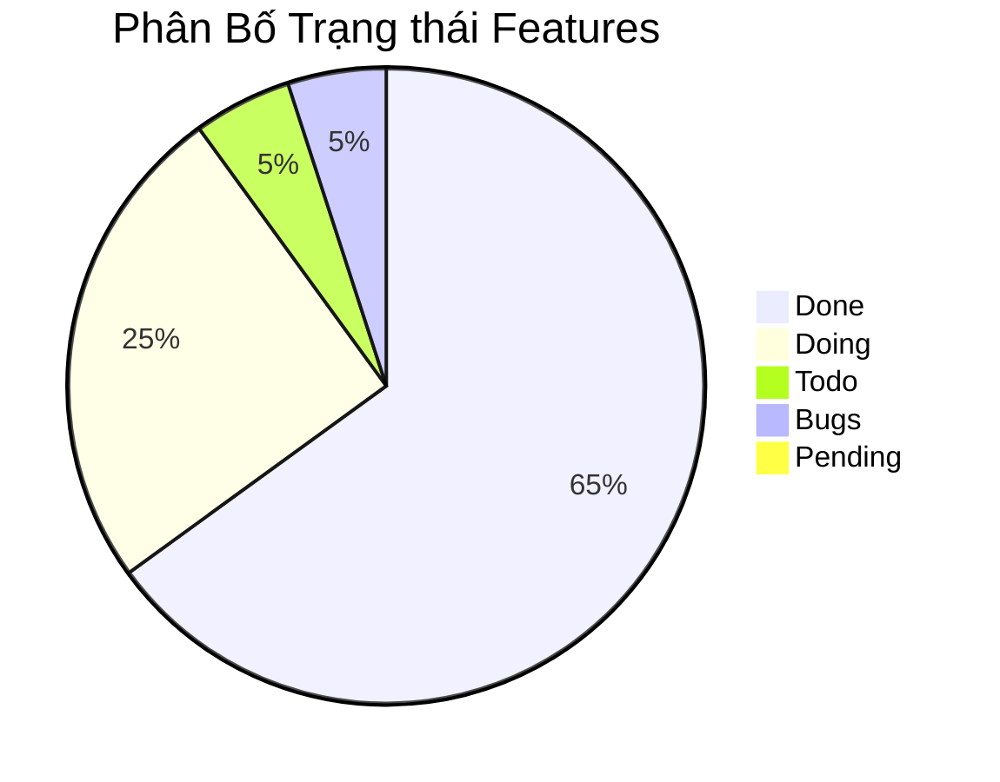

# Báo Cáo Tiến Độ Dự Án Aiptos

## Tổng Quan
> Biểu đồ thể hiện tổng quan trạng thái của toàn bộ features trong dự án

## Cập Nhật Gần Đây (29/5 - 10/6/2025)
> Cập nhật về các features đã hoàn thành và vấn đề phát sinh

### ✨ Features Hoàn Thành
- Kết nối và tương tác với ví Aptos
- Hoàn thiện tính năng tạo token mới với đầy đủ validation
- Tích hợp đăng nhập qua X (Twitter)
- Hoàn thiện trang Admin với chức năng claim rewards
- Tích hợp hoàn chỉnh bonding curve và trading history
- Cải thiện UI/UX cho trang Home và Detail
- Tích hợp đầy đủ các thông số: marketcap, volume, price
- Hoàn thiện tính năng mua/bán token với APT

### ⚠️ Vấn Đề và Giải Pháp
- Balance Token: Đang gặp vấn đề trong việc hiển thị số dư token trong ví
- Chart Integration: Đang trong quá trình hoàn thiện và tối ưu
- Production Environment: Cần hoàn thiện môi trường production và các thông tin từ khách hàng

### Progress Reports 

| Tên Features / Task | Mô tả | Trạng thái | Người thực hiện | Ngày hoàn thành |
|---|---|---|---|---|
| FR-001 - Kết nối Ví Aptos | Tích hợp và kết nối ví Aptos | Done | Team | 2025-05-30 |
| FR-002 - Tạo Token Mới | Quy trình tạo token mới với validation | Done | Mai | 2025-06-02 |
| FR-003 - Hiển thị Thông tin Chi tiết Token | Hiển thị thông tin và tương tác token | Done | Thái | 2025-06-03 |
| FR-004 - Đăng nhập X/Twitter | Tích hợp đăng nhập qua X | Done | Đức | 2025-06-03 |
| FR-005 - Trang Quản trị Token | Trang admin cho người tạo token | Done | Team | 2025-06-05 |
| FR-006 - Claim Phần thưởng Token | Chức năng claim rewards trong admin | Done | Thái | 2025-06-10 |
| FR-007 - Mua Token bằng APT | Tích hợp mua token với APT | Done | Team | 2025-06-08 |
| FR-008 - Bán Token nhận APT | Tích hợp bán token lấy APT | Done | Team | 2025-06-08 |
| FR-009 - Danh sách Token/Dự án | Hiển thị và tìm kiếm token/dự án | Done | Mai | 2025-06-08 |
| FR-010 - Dòng Chảy Giao dịch | Hiển thị transaction list | Done | Mai | 2025-06-10 |
| FR-011 - Điều khoản & Chính sách | Tài liệu pháp lý | Pending | Đức | - |
| FR-012 - Cấu hình Token Vault | Cấu hình vault khi tạo token | Done | Team | 2025-06-05 |
| FR-013 - Chỉnh sửa Metadata Token | Chỉnh sửa thông tin token từ admin | Done | Thái | 2025-06-03 |
| FR-014 - Thông tin Bot | Hiển thị thông tin bot AI | Doing | Team | - |
| FR-015 - Claim Token từ Vault | Claim token từ vault qua admin | Done | Thái | 2025-06-10 |

### Kế hoạch tiếp theo
1. Hoàn thiện môi trường production
2. Xin thông tin mainnet contract
3. Hoàn thiện các tài liệu pháp lý
4. Fix các bugs còn tồn đọng về balance token
5. Hoàn thiện tính năng chart

### Ghi chú
- Cần đẩy nhanh việc lấy thông tin từ khách hàng về legal documents và social URLs
- Cần review lại toàn bộ hệ thống trước khi deploy lên mainnet
- Cần test kỹ các tính năng liên quan đến giao dịch và tài chính

### Giải thích Trạng thái Features

Mỗi tính năng (feature) trong dự án sẽ trải qua các trạng thái sau:

1. **Todo** 📋
   - Chưa bắt đầu làm
   - Tính năng đang trong giai đoạn lên kế hoạch
   - Chưa có người được assign

2. **Committed** 💻
   - Đã hoàn thành việc code
   - Đã commit code nhưng chưa được merge vào nhánh dev
   - Các tính năng không có lỗi
   - Các user-flow đã được self-test cẩn thận và hoạt động tốt

3. **Merged** 🔄
   - Code đã được merge vào nhánh chính
   - Đã được triển khai CI/CD thành công
   - Sẵn sàng cho việc testing

4. **Tested** ✅
   - Đã test thành công và không có lỗi nghiêm trọng
   - Đã sẵn sàng cho người dùng sử dụng
   - Có thể tiến hành demo

5. **Demo** 🎯
   - Đã thực hiện demo nội bộ trong team
   - Hoạt động tốt không có lỗi đáng kể
   - Không có vấn đề ảnh hưởng tới trải nghiệm người dùng

6. **Delivered** 🚀
   - Đã thực hiện demo cho khách hàng
   - Tính năng hoạt động tốt và không có lỗi
   - Sẵn sàng cho việc deploy mainnet

7. **Mainnet** ⭐️
   - Tính năng đã được mainnet thành công
   - Đã hoàn tất việc kiểm tra lần cuối
   - Không phát hiện lỗi trong môi trường production