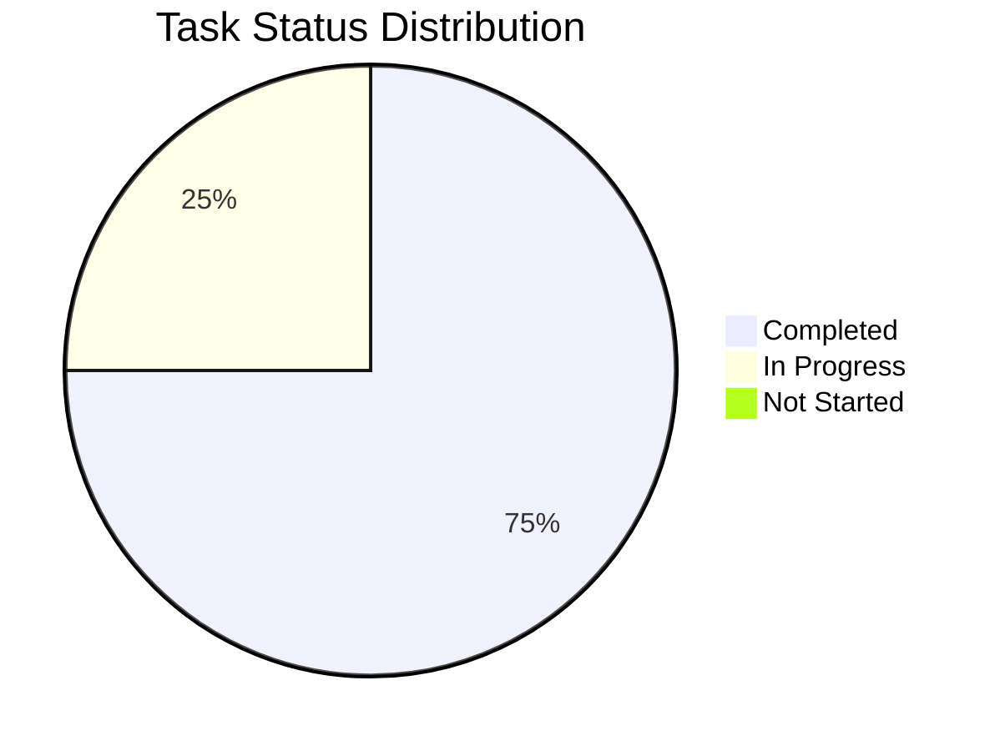

# Báo Cáo Phát Triển Cá Nhân - Thái

## 1. Tổng Quan Tiến Độ

Tổng tiến độ dự án: 75%

## 2. Báo Cáo Hoạt Động Gần Nhất

### ✨ Thành tựu

- Hoàn thiện hiển thị price chart theo giờ và theo ngày ( format được số nhỏ trên chart )
- Cập nhật animation lúc copy ( ấn vào hiển thị tích xanh 1 thời gian )
- Cập nhật hiệu ứng nhấp nháy trên logo header
- Đồng bộ lại tên component ( bỏ clanker -> project, aiptos )

### 🚧 Đang thực hiện

- Vẽ màn how it work
- Tối ưu hiển thị của price chart
- Dự kiến hoàn thành: 12/06/2025

### ⚠️ Vấn đề và Giải pháp

- Price chart: đang không rõ nên handler case chỉ có ít giao dịch ( ví dụ 1 ) như nào cho hợp lí

## 3. Danh Sách Nhiệm Vụ đã và đang Thực Hiện

### Bugs

| Bug ID  | Mô tả               | Trạng thái | Dự kiến hoàn thành | Ghi chú                 |
| ------- | ------------------- | ---------- | ------------------ | ----------------------- |
| BUG-001 | Chưa có how it work | 🔄 Doing   | 12/06/2025         | Ảnh hưởng UX của header |
