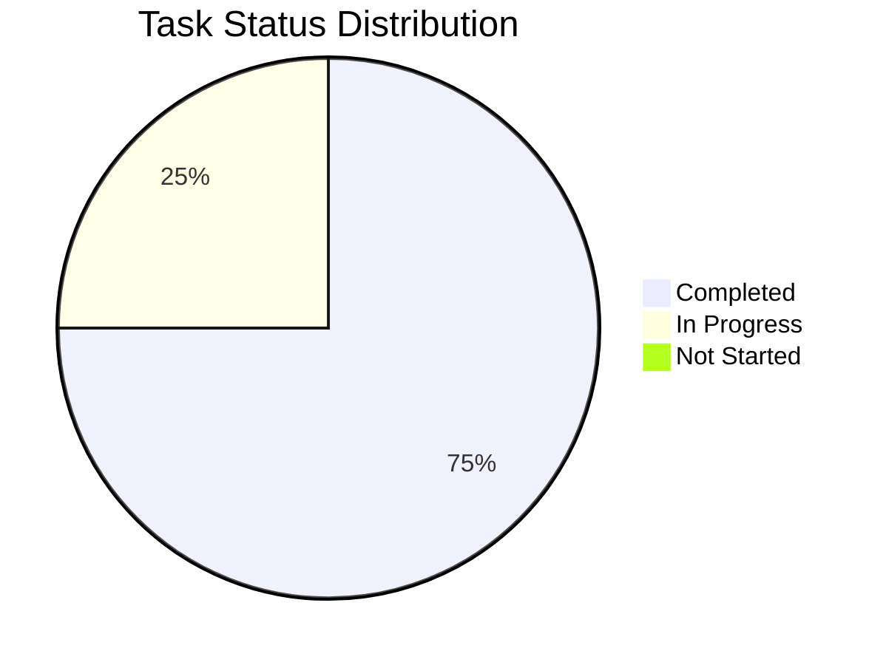

# Báo Cáo Phát Triển Cá Nhân - Thái

## 1. Tổng Quan Tiến Độ

Tổng tiến độ dự án: 75%

## 2. Báo Cáo Hoạt Động Gần Nhất

### ✨ Thành tựu

- Hoàn thiện màn hình how it works
- Tối ưu được hiển thị của price chart

### 🚧 Đang thực hiện

- Tối ưu lại UI
- Dự kiến hoàn thành: 13/06/2025

### ⚠️ Vấn đề và Giải pháp

## 3. Tasks

| Feature                                          | Todo | Committed | Merged | Tested | Demo | Delivered | Mainnet | Dự kiến hoàn thành |
| ------------------------------------------------ | :--: | :-------: | :----: | :----: | :--: | :-------: | :-----: | ------------------ |
| **[FR-003] - Hiển thị Thông tin Chi tiết Token** |      |           |        |        |      |           |         | 11/06/2025         |
| - UI Development                                 |      |           |        |        |      |     ✓     |         | 11/06/2025         |
| - Mobile Responsive                              |      |           |        |        |      |     ✓     |         | 11/06/2025         |
| - Backend APIs                                   |      |           |        |        |      |     ✓     |         | 11/06/2025         |
| - Database Design (Review)                       |      |           |        |        |      |     ✓     |         | 11/06/2025         |
| - Error Handling                                 |      |           |        |        |      |     ✓     |         | 11/06/2025         |
| - Unit Tests (>90%)                              |      |           |        |        |      |     ✓     |         | 11/06/2025         |

| Feature                                      | Todo | Committed | Merged | Tested | Demo | Delivered | Mainnet | Dự kiến hoàn thành |
| -------------------------------------------- | :--: | :-------: | :----: | :----: | :--: | :-------: | :-----: | ------------------ |
| **[FR-005] - Truy cập Trang Quản trị Token** |      |           |        |        |      |           |         | 11/06/2025         |
| - UI Development                             |      |           |        |        |      |     ✓     |         | 11/06/2025         |
| - Mobile Responsive                          |      |           |        |        |      |     ✓     |         | 11/06/2025         |
| - Backend APIs                               |      |           |        |        |      |     ✓     |         | 11/06/2025         |
| - Database Design (Review)                   |      |           |        |        |      |     ✓     |         | 11/06/2025         |
| - Error Handling                             |      |           |        |        |      |     ✓     |         | 11/06/2025         |
| - Unit Tests (>90%)                          |      |           |        |        |      |     ✓     |         | 11/06/2025         |

| Feature                           | Todo | Committed | Merged | Tested | Demo | Delivered | Mainnet | Dự kiến hoàn thành |
| --------------------------------- | :--: | :-------: | :----: | :----: | :--: | :-------: | :-----: | ------------------ |
| **[FR-006] - Mua Token bằng APT** |      |           |        |        |      |           |         | 11/06/2025         |
| - UI Development                  |      |           |        |        |      |     ✓     |         | 11/06/2025         |
| - Mobile Responsive               |      |           |        |        |      |     ✓     |         | 11/06/2025         |
| - Backend APIs                    |      |           |        |        |      |     ✓     |         | 11/06/2025         |
| - Database Design (Review)        |      |           |        |        |      |     ✓     |         | 11/06/2025         |
| - Error Handling                  |      |           |        |        |      |     ✓     |         | 11/06/2025         |
| - Unit Tests (>90%)               |      |           |        |        |      |     ✓     |         | 11/06/2025         |

| Feature                              | Todo | Committed | Merged | Tested | Demo | Delivered | Mainnet | Dự kiến hoàn thành |
| ------------------------------------ | :--: | :-------: | :----: | :----: | :--: | :-------: | :-----: | ------------------ |
| **[FR-007] - Bán Token để nhận APT** |      |           |        |        |      |           |         | 11/06/2025         |
| - UI Development                     |      |           |        |        |      |     ✓     |         | 11/06/2025         |
| - Mobile Responsive                  |      |           |        |        |      |     ✓     |         | 11/06/2025         |
| - Backend APIs                       |      |           |        |        |      |     ✓     |         | 11/06/2025         |
| - Database Design (Review)           |      |           |        |        |      |     ✓     |         | 11/06/2025         |
| - Error Handling                     |      |           |        |        |      |     ✓     |         | 11/06/2025         |
| - Unit Tests (>90%)                  |      |           |        |        |      |     ✓     |         | 11/06/2025         |

| Feature                                  | Todo | Committed | Merged | Tested | Demo | Delivered | Mainnet | Dự kiến hoàn thành |
| ---------------------------------------- | :--: | :-------: | :----: | :----: | :--: | :-------: | :-----: | ------------------ |
| **[FR-011] - Chỉnh sửa Thông tin Token** |      |           |        |        |      |           |         | 11/06/2025         |
| - UI Development                         |      |           |        |        |      |     ✓     |         | 11/06/2025         |
| - Mobile Responsive                      |      |           |        |        |      |     ✓     |         | 11/06/2025         |
| - Backend APIs                           |      |           |        |        |      |     ✓     |         | 11/06/2025         |
| - Database Design (Review)               |      |           |        |        |      |     ✓     |         | 11/06/2025         |
| - Error Handling                         |      |           |        |        |      |     ✓     |         | 11/06/2025         |
| - Unit Tests (>90%)                      |      |           |        |        |      |     ✓     |         | 11/06/2025         |

| Feature                                    | Todo | Committed | Merged | Tested | Demo | Delivered | Mainnet | Dự kiến hoàn thành |
| ------------------------------------------ | :--: | :-------: | :----: | :----: | :--: | :-------: | :-----: | ------------------ |
| **[FR-013] - Hiển thị Mục "How It Works"** |      |           |        |        |      |           |         | 12/06/2025         |
| - UI Development                           |      |           |        |   ✓    |      |           |         | 12/06/2025         |
| - Mobile Responsive                        |      |           |        |   ✓    |      |           |         | 12/06/2025         |
| - Backend APIs                             |      |           |        |        |      |           |         | 12/06/2025         |
| - Database Design (Review)                 |      |           |        |   ✓    |      |           |         | 12/06/2025         |
| - Error Handling                           |      |           |        |   ✓    |      |           |         | 12/06/2025         |
| - Unit Tests (>90%)                        |      |           |        |        |      |           |         | 12/06/2025         |
