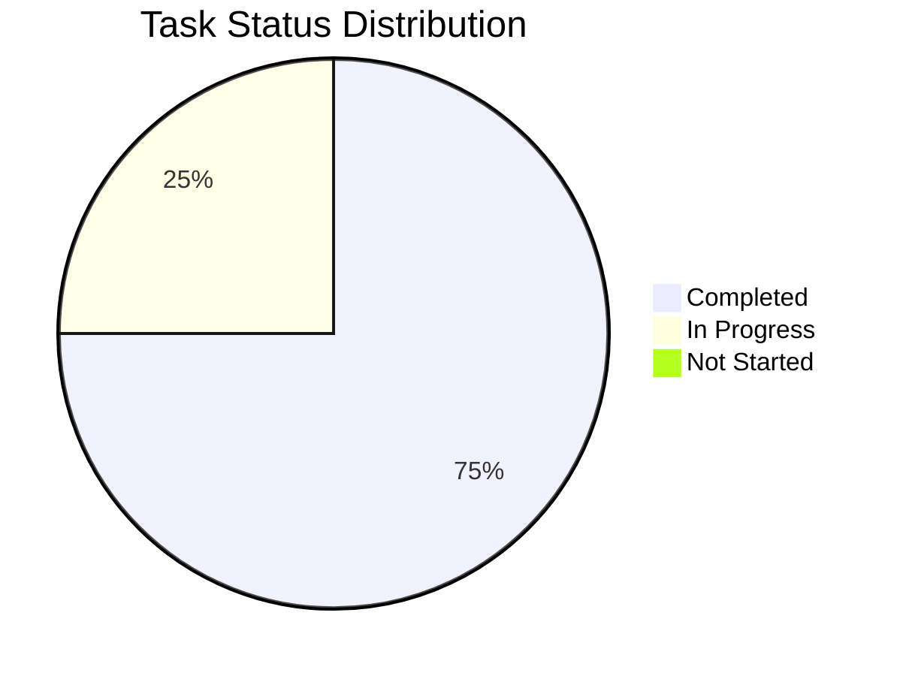

# Báo Cáo Phát Triển Cá Nhân - Thái

## 1. Tổng Quan Tiến Độ

Tổng tiến độ dự án: 75%

## 2. Báo Cáo Hoạt Động Gần Nhất

### ✨ Thành tựu

- Hoàn thiện hiển thị price chart theo giờ và theo ngày ( format được số nhỏ trên chart )
- Cập nhật animation lúc copy ( ấn vào hiển thị tích xanh 1 thời gian )
- Cập nhật hiệu ứng nhấp nháy trên logo header
- Đồng bộ lại tên component ( bỏ clanker -> project, aiptos )

### 🚧 Đang thực hiện

- Vẽ màn how it work
- Tối ưu hiển thị của price chart
- Dự kiến hoàn thành: 12/06/2025

### ⚠️ Vấn đề và Giải pháp

- Price chart: đang không rõ nên handler case chỉ có ít giao dịch ( ví dụ 1 ) như nào cho hợp lí

## 3. Danh Sách Nhiệm Vụ đã và đang Thực Hiện

### Bugs

| Bug ID  | Mô tả               | Trạng thái | Dự kiến hoàn thành | Ghi chú                 |
| ------- | ------------------- | ---------- | ------------------ | ----------------------- |
| BUG-001 | Chưa có how it work | 🔄 Doing   | 12/06/2025         | Ảnh hưởng UX của header |

### FR-003 - Hiển thị Thông tin Chi tiết Token

| Tính năng / Task                | Trạng thái    | Ngày hoàn thành | Ghi chú                                                                                                              |
| ------------------------------- | ------------- | --------------- | -------------------------------------------------------------------------------------------------------------------- |
| Hiển thị thông tin cơ bản       | ✅ Hoàn thành | 11/06/2025      | Gồm ảnh, tên, ký hiệu, mô tả, market cap, CA, Owner, followers, nút "Add to wallet", link social                     |
| Hiển thị thông tin cung cấp     | ✅ Hoàn thành | 11/06/2025      | Hiển thị rõ lượng token người tạo đã mua trước, lượng đã bán ra công chúng, và tổng cung hiện tại trên bonding curve |
| Hiển thị trạng thái token       | ✅ Hoàn thành | 11/06/2025      | "Đang giao dịch trên Bonding Curve" hoặc "Đã niêm yết trên Hyperion"                                                 |
| Hiển thị price chart            | ✅ Hoàn thành | 11/06/2025      | Dữ liệu giá từ bonding curve, thể hiện giá theo từng giao dịch                                                       |
| Hiển thị khu vực giao dịch      | ✅ Hoàn thành | 11/06/2025      | Giao diện Mua/Bán khi đang trên bonding curve, hoặc thông báo và nút "Giao dịch trên Hyperion" khi đã niêm yết       |
| Hiển thị bonding curve progress | ✅ Hoàn thành | 11/06/2025      | Thanh tiến trình trực quan cho thấy mức vốn hóa thị trường hiện tại so với mốc yêu cầu                               |
| Hiển thị bảng giao dịch gần đây | ✅ Hoàn thành | 11/06/2025      | Bảng liệt kê các giao dịch mua/bán gần nhất (loại giao dịch, số lượng, giá, thời gian)                               |
| Hiển thị nút Admin page         | ✅ Hoàn thành | 11/06/2025      | Chỉ hiển thị cho người tạo token                                                                                     |

### FR-005 - Truy cập Trang Quản trị Token (Admin Page)

| Tính năng / Task                       | Trạng thái    | Ngày hoàn thành | Ghi chú                                   |
| -------------------------------------- | ------------- | --------------- | ----------------------------------------- |
| Tạo nút Admin page trên trang chi tiết | ✅ Hoàn thành | 11/06/2025      | Chỉ hiển thị cho người tạo token          |
| Kiểm tra quyền truy cập Admin page     | ✅ Hoàn thành | 11/06/2025      | Xác thực người dùng là người tạo token    |
| Chuyển hướng đến trang Admin           | ✅ Hoàn thành | 11/06/2025      | Từ trang chi tiết token đến trang quản lý |

### FR-006 - Mua Token bằng APT trên Bonding Curve

| Tính năng / Task                       | Trạng thái    | Ngày hoàn thành | Ghi chú                                                                                           |
| -------------------------------------- | ------------- | --------------- | ------------------------------------------------------------------------------------------------- |
| Tạo giao diện nhập số lượng            | ✅ Hoàn thành | 11/06/2025      | Cho phép nhập số lượng token muốn mua hoặc số lượng APT muốn chi                                  |
| Hiển thị tỷ giá giao dịch dự kiến      | ✅ Hoàn thành | 11/06/2025      | Tỷ giá được tính từ bonding curve                                                                 |
| Tạo nút Mua và xử lý giao dịch         | ✅ Hoàn thành | 11/06/2025      | Khởi tạo giao dịch với hợp đồng bonding curve của Aiptos, yêu cầu xác nhận từ ví Aptos đã kết nối |
| Vô hiệu hóa chức năng sau khi niêm yết | ✅ Hoàn thành | 11/06/2025      | Tự động vô hiệu hóa khi token đã được niêm yết trên Hyperion                                      |

### FR-007 - Bán Token để nhận APT trên Bonding Curve

| Tính năng / Task                       | Trạng thái    | Ngày hoàn thành | Ghi chú                                                                                           |
| -------------------------------------- | ------------- | --------------- | ------------------------------------------------------------------------------------------------- |
| Tạo giao diện nhập số lượng            | ✅ Hoàn thành | 11/06/2025      | Cho phép nhập số lượng token muốn bán                                                             |
| Hiển thị số lượng APT dự kiến nhận     | ✅ Hoàn thành | 11/06/2025      | Số lượng APT được tính từ bonding curve                                                           |
| Tạo nút Bán và xử lý giao dịch         | ✅ Hoàn thành | 11/06/2025      | Khởi tạo giao dịch với hợp đồng bonding curve của Aiptos, yêu cầu xác nhận từ ví Aptos đã kết nối |
| Vô hiệu hóa chức năng sau khi niêm yết | ✅ Hoàn thành | 11/06/2025      | Tự động vô hiệu hóa khi token đã được niêm yết trên Hyperion                                      |

### FR-011 - Chỉnh sửa Thông tin (Metadata) Token từ Trang Admin

| Tính năng / Task          | Trạng thái    | Ngày hoàn thành | Ghi chú                                |
| ------------------------- | ------------- | --------------- | -------------------------------------- |
| Cập nhật metadata token   | ✅ Hoàn thành | 11/06/2025      | Gồm description, website, social links |
| Lưu và cập nhật thông tin | ✅ Hoàn thành | 11/06/2025      | Tích hợp với smart contract            |

### FR-013 - Hiển thị Mục "How It Works"

| Tính năng / Task           | Trạng thái        | Ngày hoàn thành | Ghi chú                                            |
| -------------------------- | ----------------- | --------------- | -------------------------------------------------- |
| Tạo trang How It Works     | 🔄 Đang thực hiện | 12/06/2025      | Giải thích về phí, bonding curve, và phí giao dịch |
| Tích hợp vào header/footer | 🔄 Đang thực hiện | 12/06/2025      | UI/UX implementation                               |
